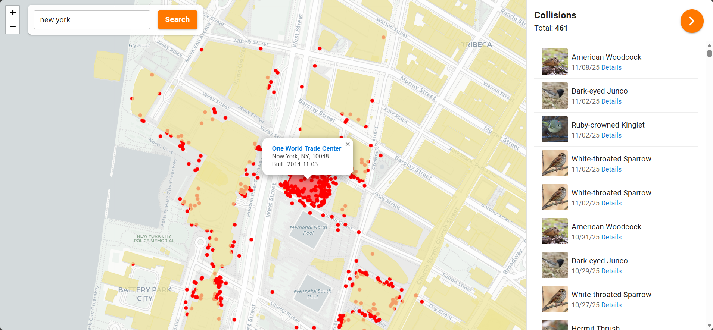
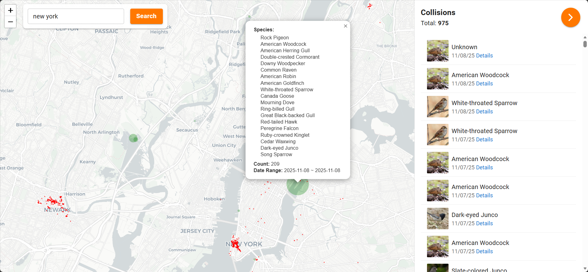

## Inspiration

Every year as many as a billion birds die while migrating. They pass through urban areas and collide with glass windows of buildings. Especially during the night, when birds are disoriented by artificial lights, this problem is even more severe. This project aims to raise awareness about bird collisions and provide a user-friendly platform to visualize bird collisions.

## Introduction

This project is a web application that visualizes bird collision data on an interactive map. Users can explore bird collision spots and observed migrating birds, view detailed information about each collision event, and learn about the impact of urban environments on bird populations. It serves as an educational tool to promote bird conservation efforts and encourage the bird-friendly designs and campaigns.





## Project Structure

For the frontend part, we use Next.js, Typescript and Material UI. We used map data from OpenStreetMap and visualized it with Leaflet.js.

For the backend part, we use Noen Supabase, a serverless Postgres database with built-in authentication and storage. The backend exposes a RESTful API to interact with the database.

The data is from [iNaturalist](https://www.inaturalist.org/projects/bird-window-collisions) and [eBird](https://www.birds.cornell.edu/landtrust/ebird-modeled-data/). Thanks to people who collected and shared the data!

## Build and Deploy

To build the frontend part, enter the `frontend` directory, create a `.env.local` file and add the necessary environment variables:

```env
NEXT_PUBLIC_API_URL=<your_api_url>
NEXT_PUBLIC_SUPABASE_URL=<your_supabase_url>
NEXT_PUBLIC_SUPABASE_KEY=<your_supabase_key>
NEXT_PUBLIC_BASE_PATH=<your_base_path> # /. or /<your_project_name> if deployed on github pages
```

and run:

```bash
pnpm install
pnpm build
```

Then a static build will be created in the `frontend/out` directory. You can deploy it with any static hosting service, such as GitHub Pages or Nginx.

## Next Steps

- Add more data sources and improve analysis
- Improve UI/UX design and add more interactive features
- Optimize performance and scalability
- Deploy the backend to a production environment

## Acknowledgements

- Bird Collision Map [New Haven Bird Window Collisions](https://www.arcgis.com/apps/webappviewer/index.html?id=c32873133aa74a2fb719e061e046463d) 
- Data from iNaturalist [Bird-window collisions · iNaturalist](https://www.inaturalist.org/projects/bird-window-collisions)
- Bird Collision Map [Explore the map | Global Bird Collision Mapper](https://www.birdmapper.org/pages/explore-the-map)
- Bird Migration Map in US [Migration Dashboard - BirdCast](https://birdcast.info/migration-tools/migration-dashboard/)
- An interactive map about weather [Windy: Wind map & weather forecast](https://www.windy.com/?25.812,-80.232,5)
- Research about Bird collision [Drivers of fatal bird collisions in an urban center | PNAS](https://www.pnas.org/doi/10.1073/pnas.2101666118)
- Lights Out Advocacy [Lights Out - BirdCast](https://birdcast.info/science-to-action/lights-out/)
- Bird Migration Overview [Products, Data, and Interpretation - BirdCast](https://birdcast.info/about/review/)
- Bird Migration Research [A continental system for forecasting bird migration | Science](https://www.science.org/doi/10.1126/science.aat7526)